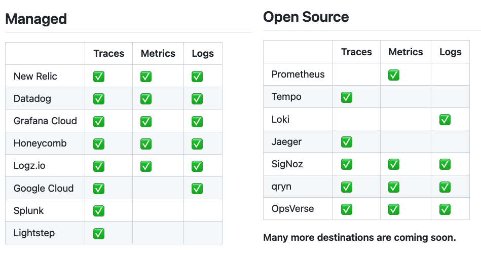

<p align="center">
    <a href="https://github.com/keyval-dev/odigos/actions/workflows/main.yml" target="_blank">
    
    </a>
    <a href="https://goreportcard.com/report/github.com/keyval-dev/odigos/cli" target="_blank">
    
    </a>
    <a href="https://godoc.org/github.com/keyval-dev/odigos/cli" target="_blank">
    
    </a>
</p>
<p align="center">

Generate distributed traces for any application without code changes
</p>
<h2 align="center">
    <a href="https://docs.odigos.io/intro">Getting Started Guide</a> • <a href="https://docs.odigos.io">Documentation</a> • <a href="https://join.slack.com/t/odigos/shared_invite/zt-1d7egaz29-Rwv2T8kyzc3mWP8qKobz~A">Join Slack Community</a>
</h2>

<p align="center">
<a href="https://www.youtube.com/watch?v=9d36AmVtuGU">
  
</a>
</p>

- 🚀 **No need to replace existing monitoring tools** - Odigos boosts current observability solutions by generating higher-quality data
- 🧑‍💻 **Language Agnostic Auto-instrumentation** - Odigos detects the programming language of any applications and automatically instruments it accordingly
- 📖 **Built with [eBPF](https://ebpf.io) & [OpenTelemetry](https://opentelemetry.io)** - Applications are instrumented using well-known, battle-tested open source observability technologies
- ✨ **Auto-instrumentation for Go applications** - Odigos leverages eBPF uniquely to instrument compiled languages without code changes
- 🔭 **Collector Management** - Auto-scale collectors based on application usage. No need to deploy or configure complex pipelines

## Installation

The easiest way to install Odigos is to use our [Helm chart](https://github.com/keyval-dev/odigos-charts):

```console
helm repo add odigos https://keyval-dev.github.io/odigos-charts/

helm install my-odigos odigos/odigos --namespace odigos-system --create-namespace
```

See the [quickstart guide](https://docs.odigos.io/intro) for more details and examples.

## Supported Destinations



See [DESTINATIONS.md](DESTINATIONS.md) file for a complete list of supported destinations and the available signals for every destination.

Can't find the destination you need? Help us by following our quick [adding new destination](https://docs.odigos.io/adding-new-dest) guide and submit a PR.

## Project Status

This project is actively maintained by [keyval](https://keyval.dev). We would love to receive your [ideas, feedback & contributions](https://join.slack.com/t/odigos/shared_invite/zt-1d7egaz29-Rwv2T8kyzc3mWP8qKobz~A).

## Contributing

Please refer to the [CONTRIBUTING.md](CONTRIBUTING.md) file for information about how to get involved. We welcome issues, questions, and pull requests. You are welcome to join our active [Slack Community](https://join.slack.com/t/odigos/shared_invite/zt-1d7egaz29-Rwv2T8kyzc3mWP8qKobz~A).

## License

This project is licensed under the terms of the Apache 2.0 open source license. Please refer to [LICENSE](LICENSE) for the full terms.
